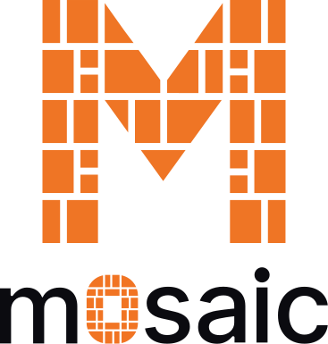

<p align="center">
  <a href="https://github.com/m0saic-project/m0saic">
    <picture>
      <source media="(prefers-color-scheme: dark)" srcset="assets/logo.svg">
      <source media="(prefers-color-scheme: light)" srcset="assets/logo-light.svg">
      
    </picture>
  </a>
</p>

<h3 align="center">Write TypeScript. Compile to video.</h3>

<p align="center">
  <a href="https://github.com/m0saic-project/m0saic"></a>
</p>

<p align="center">
  <strong>Start at the front door: <a href="https://github.com/m0saic-project/m0saic">github.com/m0saic-project/m0saic</a></strong><br>
  <sub>The README, the first run, the Claude Code plugin and the Agent Skills, and the issue tracker. A star there helps people find it.</sub>
</p>

<p align="center">
  <a href="https://m0saic.io"></a>
  <a href="https://www.npmjs.com/package/m0saic"></a>
  <a href="https://app.m0saic.io"></a>
  <a href="https://discord.gg/ns58hGm6Mm"></a>
</p>

<p align="center">
  <a href="https://x.com/qsbuilds"></a>
  <a href="https://mosaicengine.substack.com"></a>
  <a href="https://reddit.com/r/m0saic"></a>
  <a href="mailto:hi@m0saic.io"></a>
</p>

---

m0saic is a video compiler. A template is a TypeScript program that returns an [m0](https://github.com/m0saic-dsl/m0)
string (rectangles on a canvas) and one source per rectangle; m0saic compiles that to ffmpeg and hands you back
a video or an image. No browser in the pipeline, no timeline to drag, and the same inputs always give the same
bytes.

```sh
npx m0saic hello-world
```

Three surfaces, one compiler: [Mosaic Web](https://app.m0saic.io) to look first, [Mosaic Desktop](https://m0saic.io/download)
for the full workspace, and [the CLI](https://www.npmjs.com/package/m0saic) for anywhere ffmpeg runs.

---

## What's here

| | |
|---|---|
| ⭐ **[m0saic](https://github.com/m0saic-project/m0saic)** | the front door: the README, the first run, the Claude Code plugin and Agent Skills, issues |
| ◻️ **[m0saic-dsl/m0](https://github.com/m0saic-dsl/m0)** | the m0 language: parser, validator, stdlib, file formats. Apache-2.0 |
| 📦 **[m0saic-packages](https://github.com/m0saic-project/m0saic-packages)** | the public substrate: types, platform, template utilities, the template library |
| 🧩 **[m0saic-community-templates](https://github.com/m0saic-project/m0saic-community-templates)** | the community library, signed releases |
| 🫂 **[community-m](https://github.com/m0saic-project/community-m)** | the Community M: one tile per contributor |
| 🧱 **Starters** | a template repo to point your agent at: [full](https://github.com/m0saic-project/m0saic-template-repo-starter) · [base](https://github.com/m0saic-project/m0saic-template-repo-starter-base) |
| 🤖 **[one-a-day](https://github.com/m0saic-project/one-a-day)** | an agent that ships one template a day |
| 📓 **[m0saic-sandbox](https://github.com/m0saic-project/m0saic-sandbox)** | the graded candidate corpus from the agent loop, read-only |
| 💻 **[mosaic-desktop-releases](https://github.com/m0saic-project/mosaic-desktop-releases/releases)** | Mosaic Desktop builds for macOS and Windows |

---

## Links

| | |
|---|---|
| Website | [m0saic.io](https://m0saic.io) · [why rectangles](https://m0saic.io/why) · [gallery](https://m0saic.io/gallery) · [for developers and agents](https://m0saic.io/developers) |
| Apps | [app.m0saic.io](https://app.m0saic.io) · [download Mosaic Desktop](https://m0saic.io/download) |
| npm | [m0saic](https://www.npmjs.com/package/m0saic) · [@m0saic](https://www.npmjs.com/org/m0saic) |
| Community | [Discord](https://discord.gg/ns58hGm6Mm) · [r/m0saic](https://reddit.com/r/m0saic) · [Substack](https://mosaicengine.substack.com) |

---

<p align="center">
  <sub>Developed and maintained by <strong>m0saic LLC</strong> · <a href="mailto:hi@m0saic.io">hi@m0saic.io</a></sub>
</p>
